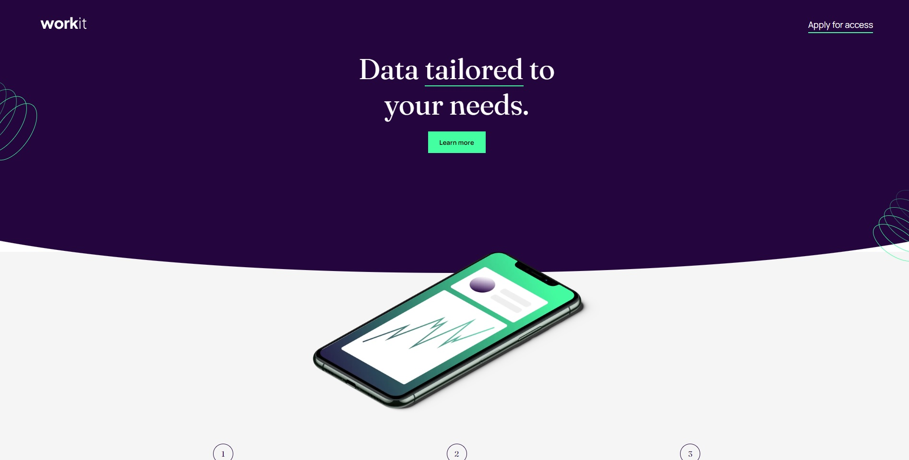
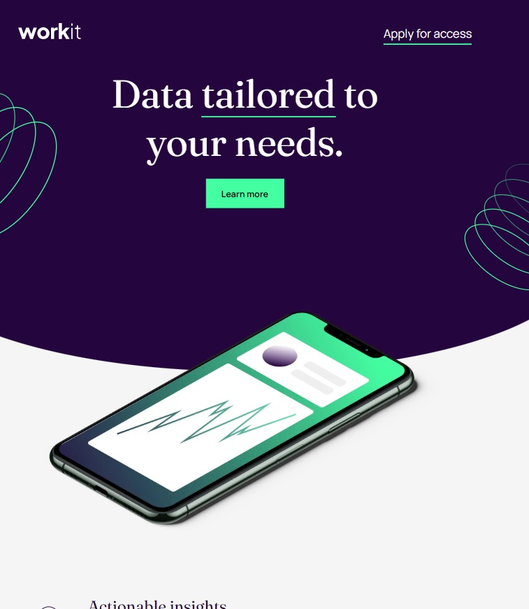
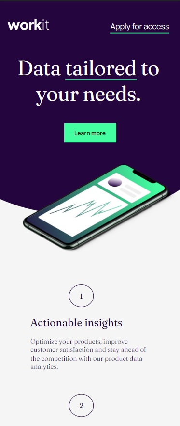

# Frontend Mentor - Workit landing page solution

This is a solution to the [Workit landing page challenge on Frontend Mentor](https://www.frontendmentor.io/challenges/workit-landing-page-2fYnyle5lu).

## Table of contents

-   [Screenshot](#screenshot)
-   [Links](#links)
-   [My process](#my-process)
-   [Built with](#built-with)
-   [What I learned](#what-i-learned)

### Screenshot

### Links

-   Solution URL: [Frontend Mentor](https://www.frontendmentor.io/solutions/workit-landing-page-jPIDCjQDjA)
-   Live Site URL: [Vercel](https://frontendmentor-workit-landing-page.vercel.app/)

## My process

Built the landing page using HTML, and SASS. Focused on doing the desktop version first ang progressed to the tablet and mobile versions.

### Built with

-   HTML5
-   CSS and SASS
-   Flexbox

### What I learned

Learned how to make round bottoms in the divs. However I still have doubt about if this is the best approach to this problem or not.

By making the divs bigger than 100% of the body I was able to round the bottom using the comand corner radius.

However as soon as the width of the display is changed all off this functions are needed to be readjusted. There must be a better way to approach this issue.
